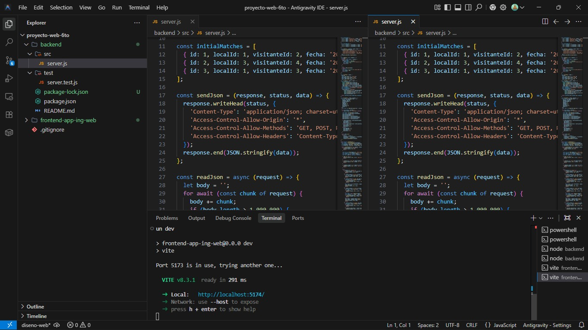
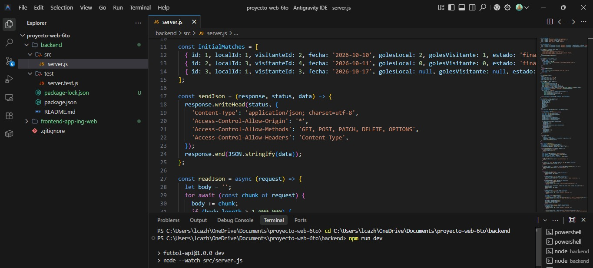

# ⚽ Cancha - Liga de Barrio

¡Bienvenido al proyecto **Cancha**! Una plataforma web moderna para gestionar y visualizar los datos de tu liga de fútbol local (Liga de Barrio - Temporada 2026).

## 📸 Vistas del Proyecto

*(Guarda tus capturas de pantalla en una carpeta llamada `imagenes` dentro de este proyecto con los nombres indicados abajo, y aparecerán aquí automáticamente)*

### Interfaz Visual (Frontend)


### Servidor y Código (Backend)


---

## 🚀 Tecnologías Utilizadas

- **Frontend:** React, Vite, CSS puro (diseño moderno y responsivo).
- **Backend:** Node.js puro (API REST sin frameworks adicionales para máxima ligereza).
- **Comunicación:** Axios para el consumo de la API.

## 🛠️ Cómo ejecutar el proyecto localmente

Para ver el proyecto en tu propia computadora, necesitas abrir dos terminales:

### 1. Iniciar la API (Backend)
```bash
cd backend
npm install
npm run dev
```
La API estará corriendo en `http://localhost:3000`.

### 2. Iniciar la Interfaz (Frontend)
Abre una nueva terminal y ejecuta:
```bash
cd frontend-app-ing-web
npm install
npm run dev
```
La web estará disponible en `http://localhost:5173` (o el puerto que te indique la terminal).

---
*Desarrollado para el proyecto web de 6to.*
